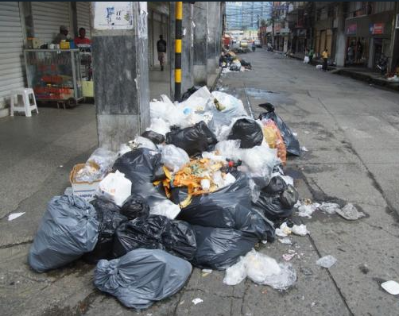
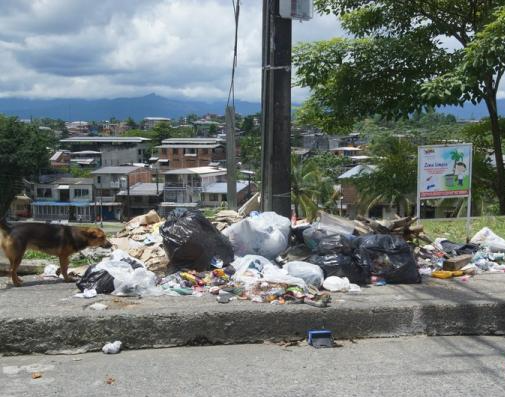

# PROYECTO
> Sistema Web de Gestión de Rutas de Recolección de Basura – Buenaventura  

# Contexto del Problema  
En **Buenaventura (Colombia)** los ciudadanos enfrentan dificultades con la recolección de basura:  
- No existe claridad sobre **a qué hora pasa el camión** en cada barrio.  
- Los vecinos sacan las bolsas a cualquier hora → los residuos permanecen en la calle.  
- Animales y personas que rebuscan rompen las bolsas → contaminación, malos olores y desorden.  
- El conductor avisa solo con un **pito improvisado**, sin tiempo suficiente para reaccionar.  

> Esto genera una **mala percepción del servicio**, afecta la **salubridad** y deteriora la **imagen urbana** de la ciudad.  

---
#  Objetivos del Proyecto  
1. - Diseñar e implementar una **aplicación web en Angular standalone**.  
2. - Informar los **horarios y rutas de los camiones** de manera clara y confiable.  
3. - Simular y visualizar recorridos en un **mapa interactivo**.  
4. - Integrar un flujo de trabajo ágil con **GitHub (issues, ramas, PRs, revisiones)**.  
5. - Configurar pipelines de **CI/CD en GitHub Actions**.  
6. - Automatizar despliegues en **staging y producción**.  
7. - Garantizar **calidad y seguridad** con pruebas automatizadas y linters.  
8. - Documentar y presentar el proyecto con un **informe en Markdown** y una **exposición final**.  
---
# Guia visual
# Así se ve freecuentemenete 
> Esta imagen describe lo que estoy escribiendo

> Descripción de lo añadido

---
